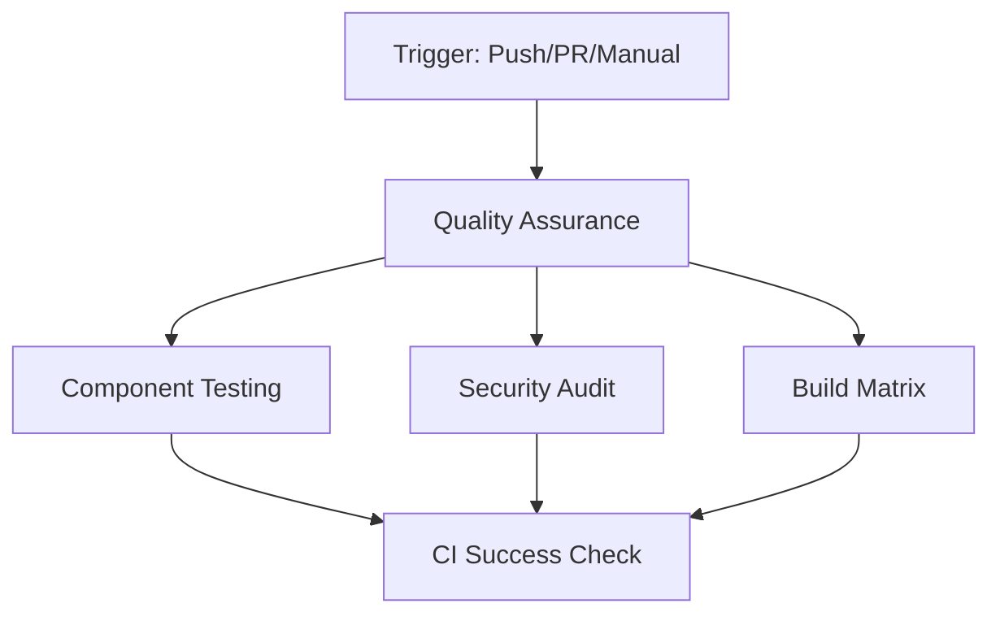

# CI/CD Pipeline Documentation

[](https://github.com/YOUR_USERNAME/convert-translation/actions/workflows/ci.yml)

This document describes the comprehensive CI/CD pipeline for the Convert Translation application, ensuring code quality and application reliability.

## Pipeline Overview

The CI/CD pipeline consists of multiple jobs that run in parallel and sequence to validate different aspects of the application:



## Jobs Description

### 1. Quality Assurance (Matrix: Node 18.x & 20.x)
**Purpose**: Core quality checks across multiple Node.js versions
**Duration**: ~8-12 minutes
**Steps**:
- ✅ **Dependency Installation**: `pnpm install --frozen-lockfile`
- ✅ **TypeScript Compilation**: `pnpm run type-check` (Zero errors required)
- ✅ **ESLint Code Quality**: `pnpm run lint` (All rules must pass)
- ✅ **Unit Testing**: `pnpm run test:unit -- --run` (309+ tests)
- ✅ **Production Build**: `pnpm run build` (Build verification)

### 2. Component Testing
**Purpose**: Extended testing for Vue components and specific functionality
**Duration**: ~5-8 minutes
**Dependencies**: Requires Quality Assurance to pass
**Steps**:
- 🎭 **Skeleton Components**: Test loading skeleton components
- 📁 **File Management**: Test file upload/replacement functionality
- ⚡ **Reactivity Fixes**: Test Pinia store reactivity improvements
- 🔄 **File Replacement Logic**: Test file clearing and replacement

### 3. Security Audit
**Purpose**: Dependency vulnerability scanning
**Duration**: ~2-3 minutes
**Steps**:
- 🔒 **Security Audit**: `pnpm audit --audit-level moderate`

### 4. Build Matrix
**Purpose**: Test builds in different environments
**Duration**: ~5-7 minutes
**Dependencies**: Requires Quality Assurance to pass
**Matrix**:
- 🏗️ **Development Build**: `pnpm run build --mode development`
- 🏗️ **Production Build**: `pnpm run build`

### 5. CI Success Check
**Purpose**: Final validation and status reporting
**Duration**: ~1 minute
**Dependencies**: All previous jobs must complete
**Output**: Comprehensive success/failure report

## Trigger Events

### Automatic Triggers
- **Push to main branch**: Full pipeline execution
- **Pull Request to main**: Full pipeline execution for validation
- **Workflow dispatch**: Manual trigger for testing

### Concurrency Control
- Cancels in-progress workflows when new commits are pushed
- Prevents resource waste and ensures latest code is tested

## Technology Stack Validation

### Vue 3 + TypeScript + Pinia Architecture
- ✅ **Vue 3 Composition API**: Component testing validates patterns
- ✅ **TypeScript Strict Mode**: Zero compilation errors enforced
- ✅ **Pinia Store Integration**: Reactivity and state management tested
- ✅ **storeToRefs Reactivity**: Template reactivity patterns validated

### UI Framework and Styling
- ✅ **shadcn-vue Components**: Component library compatibility
- ✅ **Tailwind CSS**: Styling framework build verification
- ✅ **Slate Color Scheme**: Design system consistency
- ✅ **Dark Mode Support**: Theme switching functionality

### Testing Framework
- ✅ **Vitest**: 309+ unit tests execution
- ✅ **Vue Test Utils**: Component testing utilities
- ✅ **Coverage Reporting**: Test coverage validation

### Build and Development Tools
- ✅ **Vite**: Build tool and dev server
- ✅ **ESLint**: Code quality and style enforcement
- ✅ **TypeScript**: Type checking and compilation

## Performance Optimizations

### Caching Strategy
- **pnpm Store Cache**: Dependencies cached between runs
- **Cache Key**: Based on `pnpm-lock.yaml` hash
- **Restore Keys**: Fallback cache restoration

### Parallel Execution
- **Matrix Strategy**: Node.js versions tested in parallel
- **Independent Jobs**: Security audit and build matrix run concurrently
- **Fail Fast**: Early termination on critical failures

### Artifact Management
- **Build Artifacts**: Uploaded for Node 20.x builds
- **Retention**: 7-day artifact retention
- **Size Optimization**: Only essential files included

## Quality Gates

### TypeScript Compliance
- **Zero Errors**: No TypeScript compilation errors allowed
- **Strict Mode**: All strict TypeScript rules enforced
- **Type Safety**: No `any` types or type assertions

### Code Quality Standards
- **ESLint Rules**: All linting rules must pass
- **Code Style**: Consistent formatting and patterns
- **Best Practices**: Vue 3 and TypeScript best practices

### Test Coverage Requirements
- **Unit Tests**: All 309+ tests must pass
- **Component Tests**: Vue component behavior validation
- **Integration Tests**: Feature workflow testing
- **Regression Tests**: Recent fixes and improvements

### Security Standards
- **Dependency Audit**: No moderate+ severity vulnerabilities
- **Package Integrity**: Frozen lockfile validation
- **Supply Chain**: Secure dependency management

## Monitoring and Reporting

### Status Badges
Add to your README.md:
```markdown
[](https://github.com/YOUR_USERNAME/convert-translation/actions/workflows/ci.yml)
```

### Failure Notifications
- **GitHub Checks**: Integrated with PR status checks
- **Email Notifications**: Configurable for repository maintainers
- **Slack Integration**: Optional webhook notifications

### Success Metrics
- **Build Time**: Target <15 minutes total pipeline time
- **Test Coverage**: Maintain 309+ passing tests
- **Security Score**: Zero moderate+ vulnerabilities
- **Build Success Rate**: Target >95% success rate

## Troubleshooting

### Common Issues

**TypeScript Errors**:
```bash
# Local debugging
pnpm run type-check
```

**Test Failures**:
```bash
# Run specific test categories
pnpm run test:unit src/__tests__/skeleton-components.test.ts -- --run
pnpm run test:unit src/__tests__/file-management.test.ts -- --run
```

**Build Failures**:
```bash
# Local build testing
pnpm run build
```

**Dependency Issues**:
```bash
# Clean install
rm -rf node_modules pnpm-lock.yaml
pnpm install
```

### Local Validation
Before pushing, run the same checks locally:
```bash
# Full local validation
pnpm install
pnpm run type-check
pnpm run lint
pnpm run test:unit -- --run
pnpm run build
```

## Maintenance

### Regular Updates
- **Dependencies**: Monthly security updates
- **Node.js Versions**: Update matrix when new LTS releases
- **Actions**: Update to latest action versions quarterly

### Performance Monitoring
- **Pipeline Duration**: Monitor for performance degradation
- **Cache Hit Rate**: Optimize caching strategy
- **Resource Usage**: Monitor runner resource consumption

This CI/CD pipeline ensures that all recent improvements including Pinia store integration, file replacement logic, skeleton components, and TypeScript compliance work correctly in a clean environment, providing confidence in code quality and application reliability.
