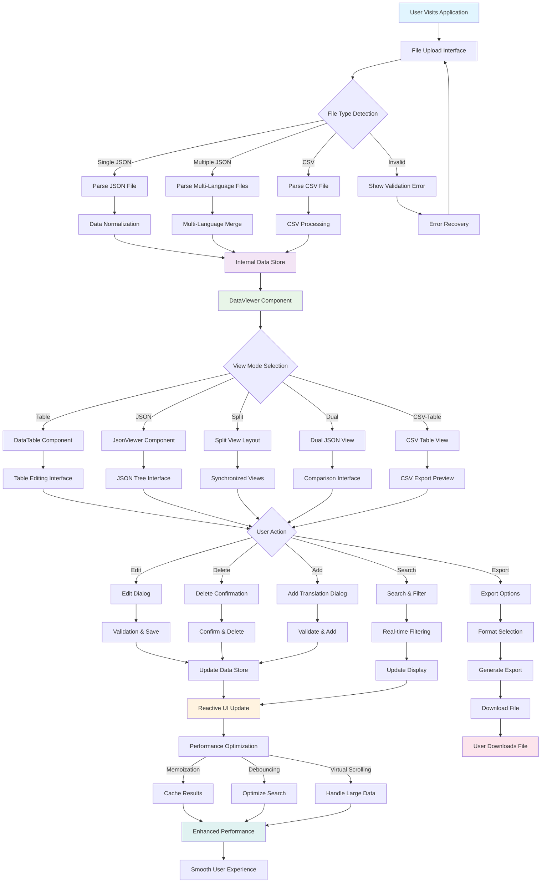

# Convert Translation

A modern, high-performance translation file converter and manager built with Vue 3, TypeScript, and Vite. This application provides seamless conversion between JSON and CSV translation files, with advanced editing capabilities, multi-language support, and intelligent validation.

## 🌟 Application Overview

**Convert Translation** is a comprehensive web application designed for developers, translators, and localization teams who need to manage translation files efficiently. The application bridges the gap between different translation file formats while providing powerful editing and validation tools.

### Target Users
- **Frontend Developers** managing i18n files
- **Localization Teams** working with multiple languages
- **Translators** needing user-friendly editing interfaces
- **Project Managers** overseeing translation workflows

### Key Features
- **Multi-format Support**: JSON, CSV, and multi-language JSON files
- **Real-time Conversion**: Instant transformation between formats
- **Advanced Editing**: Add, edit, and delete translations with confirmation dialogs
- **Multi-language Management**: Support for English, Indonesian, Chinese Simplified, and Chinese Traditional
- **Intelligent Validation**: File format validation with helpful error messages
- **Performance Optimized**: Handles large files (5MB+) with memoization and caching
- **Modern UI**: Clean, responsive interface built with shadcn-vue components
- **Search & Filter**: Advanced search with highlighting and language filtering
- **Export Options**: Flexible export with customizable settings

## 🏗️ How It Works

### Technical Architecture
The application follows a modern Vue 3 composition API architecture with TypeScript for type safety. It uses a component-based design with reactive state management and optimized performance patterns.

### Supported File Formats

#### 1. **Single Language JSON**
```json
{
  "app.title": "My Application",
  "nav.home": "Home",
  "nav.about": "About"
}
```

#### 2. **Multi-language JSON** (Multiple files)
```json
// en.json
{
  "app.title": "My Application",
  "nav.home": "Home"
}

// es.json
{
  "app.title": "Mi Aplicación",
  "nav.home": "Inicio"
}
```

#### 3. **CSV Format**
```csv
Key,English,Spanish
app.title,My Application,Mi Aplicación
nav.home,Home,Inicio
```

### Data Transformation Process
1. **File Upload** → Validation → Parsing
2. **Format Detection** → Type-specific processing
3. **Data Normalization** → Internal representation
4. **View Rendering** → User interface updates
5. **Export Processing** → Format-specific output

### Performance Optimizations
- **Memoization**: Cached data transformations for repeated operations
- **Debouncing**: Search input optimization (300ms delay)
- **Virtual Scrolling**: Efficient rendering for large datasets
- **Lazy Loading**: Progressive data loading for better UX
- **Smart Caching**: LRU cache implementation for frequently accessed data

## 📖 User Guide

### Installation

#### Prerequisites
- Node.js 18+
- pnpm or yarn package manager

#### Setup Instructions
```bash
# Clone the repository
git clone <repository-url>
cd convert-translation

# Install dependencies
pnpm install

# Start development server
pnpm run dev
```

The application will be available at `http://localhost:5174`

### Running the Application

#### Development Mode
```bash
pnpm run dev
```
- Hot reload enabled
- Development tools available
- Source maps for debugging

#### Production Build
```bash
pnpm run build
pnpm run preview
```

### Step-by-Step Usage Guide

#### 1. **File Upload and Validation**

**Upload Single JSON File:**
1. Click "Choose Files" or drag & drop a JSON file
2. System validates file format and structure
3. Preview appears with file details
4. Click "Process Files" to load data

**Upload Multiple JSON Files:**
1. Select multiple JSON files (e.g., en.json, es.json, zh.json)
2. System detects multi-language structure
3. Files are merged into unified view
4. Language tabs appear for easy navigation

**Upload CSV File:**
1. Upload CSV with Key column and language columns
2. System validates CSV structure and headers
3. Automatic language detection from column names
4. Data loads into table view

#### 2. **View Switching**

The application provides 5 different view modes:

**Table View** - Spreadsheet-like editing interface
- Edit translations directly in cells
- Add/delete rows with confirmation dialogs
- Sort and filter by columns
- Bulk operations support

**JSON View** - Raw JSON with syntax highlighting
- Tree structure with collapsible nodes
- Search with real-time highlighting
- Copy/paste JSON snippets
- Validation error indicators

**Split View** - Side-by-side JSON and table
- Synchronized scrolling
- Real-time updates between views
- Compare different representations
- Ideal for verification workflows

**Dual View** - Two JSON panels for comparison
- Compare different language versions
- Side-by-side translation review
- Synchronized navigation
- Perfect for translation validation

**CSV Table View** - CSV-optimized table display
- CSV-specific formatting
- Export-ready preview
- Column reordering
- Custom delimiter support

#### 3. **Editing Translations**

**Add New Translation:**
1. Click "Add Translation" button
2. Enter translation key (e.g., "nav.settings")
3. Enter translation value
4. Select target language (for multi-language files)
5. Click "Save" to add the translation

**Edit Existing Translation:**
1. Click edit icon (✏️) next to any translation
2. Modify key or value in the dialog
3. Changes are validated in real-time
4. Click "Save Changes" to apply
5. UI updates immediately across all views

**Delete Translation:**
1. Click delete icon (🗑️) next to translation
2. Confirmation dialog appears with details
3. Review the key and value to be deleted
4. Click "Delete" to confirm or "Cancel" to abort
5. Translation is removed from all languages

**Bulk Operations:**
- Select multiple rows using checkboxes
- Apply bulk edit or delete operations
- Confirmation dialogs for safety
- Undo functionality for accidental changes

#### 4. **Language Filtering and Management**

**Language Selection:**
1. Use language filter dropdown
2. Select specific languages to display
3. Table columns adjust automatically
4. JSON view filters to selected languages

**Supported Languages:**
- **English** - Primary language for most projects
- **Indonesian (Bahasa Indonesia)** - Full Unicode support
- **Chinese Simplified** - Simplified Chinese characters
- **Chinese Traditional** - Traditional Chinese characters

**Language Management:**
- Add new language columns dynamically
- Remove unused languages
- Reorder language priority
- Validate language-specific content

#### 5. **Advanced Search Features**

**Real-time Search:**
- Type in search box for instant filtering
- Search across keys and values
- Debounced input (300ms) for performance
- Case-insensitive matching

**Search Highlighting:**
- Matching text highlighted in yellow
- Works across all view modes
- Maintains highlighting during navigation
- Clear search to remove filters

**Advanced Filters:**
- Filter by specific languages
- Show only empty translations
- Filter by key patterns (regex support)
- Combine multiple filter criteria

#### 6. **Export Functionality**

**Export Options:**
1. Click "Export" button
2. Choose export format (JSON/CSV)
3. Select languages to include
4. Configure export settings:
   - Generate separate files per language
   - Include empty values
   - Add language prefix to filenames
   - Custom file naming patterns

**Export Formats:**

**Single JSON Export:**
```json
{
  "app.title": "My Application",
  "nav.home": "Home"
}
```

**Multi-language JSON Export:**
- Separate files: `translations_English.json`, `translations_Spanish.json`
- Unified file: Single JSON with language objects

**CSV Export:**
```csv
Key,English,Spanish,Chinese_Simplified
app.title,My Application,Mi Aplicación,我的应用程序
nav.home,Home,Inicio,首页
```

## 🛠️ Development Guide

### Project Structure

```
src/
├── components/           # Vue components
│   ├── ui/              # shadcn-vue UI components
│   ├── DataViewer.vue   # Main data display component
│   ├── DataTable.vue    # Table view component
│   ├── JsonViewer.vue   # JSON view component
│   ├── FileUploader.vue # File upload component
│   ├── UploadedFilesList.vue # Uploaded files management
│   └── ReplaceDataConfirmDialog.vue # File replacement confirmation
├── stores/              # Pinia state management
│   ├── index.ts         # Store exports and configuration
│   ├── translation.ts   # Translation data store
│   ├── language.ts      # Language selection store
│   ├── files.ts         # File management store
│   └── ui.ts           # UI state store
├── composables/         # Vue composition functions
│   ├── useMultiLanguage.ts # Multi-language operations
│   ├── useFileUploadConfirmation.ts # Upload confirmation logic
│   ├── useSearch.ts     # Search functionality
│   └── useConversion.ts # Format conversion
├── utils/               # Utility functions
│   ├── csv.ts          # CSV processing
│   ├── validation.ts   # File validation
│   ├── memoization.ts  # Performance optimization
│   └── filename-validation.ts # File naming validation
├── types/              # TypeScript type definitions
│   └── index.ts        # Main type exports
└── __tests__/          # Test files
    ├── components/     # Component tests
    ├── composables/    # Composable tests
    ├── stores/         # Store tests
    ├── utils/          # Utility tests
    └── integration/    # Integration tests
```

### Technology Stack

**Core Framework:**
- **Vue 3** - Progressive JavaScript framework
- **TypeScript** - Type-safe JavaScript
- **Vite** - Fast build tool and dev server

**UI Framework:**
- **shadcn-vue** - Modern component library
- **Tailwind CSS** - Utility-first CSS framework
- **Lucide Vue** - Beautiful icon library
- **vue-json-pretty** - JSON tree visualization

**State Management:**
- **Pinia** - Modern state management with TypeScript support
- **Vue Composition API** - Reactive state management
- **storeToRefs** - Reactive store property extraction for templates

**Development Tools:**
- **Vitest** - Unit testing framework
- **Vue Test Utils** - Vue component testing
- **ESLint** - Code linting
- **Prettier** - Code formatting
- **TypeScript** - Type checking

### Code Organization and Patterns

#### Composition API Pattern
```typescript
// composables/useEditDelete.ts
export function useEditDelete() {
  const isEditDialogOpen = ref(false)
  const currentEditData = ref<EditTranslationData | null>(null)

  function openEditDialog(key: string, value: string, language?: string) {
    currentEditData.value = { key, value, language }
    isEditDialogOpen.value = true
  }

  return {
    isEditDialogOpen,
    currentEditData,
    openEditDialog
  }
}
```

#### Component Communication Pattern
```typescript
// Parent component
<DataViewer
  :csv-data="csvData"
  @edit-row="handleEditRow"
  @delete-row="handleDeleteRow"
/>

// Child component emits
const emit = defineEmits<{
  'edit-row': [row: CSVRow, index: number]
  'delete-row': [row: CSVRow, index: number]
}>()
```

#### Type Safety Implementation
```typescript
// types/index.ts
export interface CSVData {
  headers: string[]
  rows: CSVRow[]
}

export interface CSVRow {
  Key: string
  [language: string]: string
}

export interface TranslationData {
  [key: string]: string
}
```

### Testing Approach

#### Test Structure
```bash
# Run all tests
pnpm run test:unit

# Run specific test file
pnpm run test:unit -- filename.test.ts

# Run tests in watch mode
pnpm run test:unit -- --watch

# Run tests with coverage
pnpm run test:unit -- --coverage
```

#### Component Testing Example
```typescript
// __tests__/components/DataTable.test.ts
import { mount } from '@vue/test-utils'
import DataTable from '@/components/DataTable.vue'

describe('DataTable', () => {
  it('should emit delete-row event when delete button clicked', async () => {
    const wrapper = mount(DataTable, {
      props: { data: mockCSVData, showActions: true }
    })

    await wrapper.find('[data-testid="delete-button"]').trigger('click')

    expect(wrapper.emitted('delete-row')).toBeTruthy()
  })
})
```

#### Integration Testing
```typescript
// __tests__/delete-integration.test.ts
describe('Delete Integration Tests', () => {
  it('should handle delete operations correctly', () => {
    const { deleteTranslationFromData } = useEditDelete()
    const result = deleteTranslationFromData(testData, deleteData)
    expect(result.success).toBe(true)
  })
})
```

#### Performance Testing
```typescript
it('should handle large datasets efficiently', () => {
  const start = performance.now()
  // ... operation
  const duration = performance.now() - start
  expect(duration).toBeLessThan(500) // < 500ms
})
```

## 🤝 Contributing Guidelines

### Development Environment Setup

1. **Fork and Clone**
```bash
git clone https://github.com/your-username/convert-translation.git
cd convert-translation
```

2. **Install Dependencies**
```bash
pnpm install
```

3. **Create Feature Branch**
```bash
git checkout -b feature/your-feature-name
```

4. **Start Development**
```bash
pnpm run dev
```

### Code Style and Standards

#### ESLint Configuration
The project uses ESLint with TypeScript support:
```bash
# Check for linting errors
pnpm run lint

# Auto-fix linting errors
pnpm run lint -- --fix
```

#### TypeScript Standards
- **Strict mode enabled** - No `any` types or type assertions (`as` keyword) allowed
- **Explicit return types** for functions and computed properties
- **Interface definitions** for all data structures from `src/types/index.ts`
- **Type guards** for runtime type checking
- **Pinia store typing** - All stores use proper TypeScript with `defineStore`
- **Reactive property typing** - `storeToRefs` for template reactivity
- **Zero compilation errors** - `npm run type-check` must pass

#### Vue 3 Standards
- **Composition API** preferred over Options API
- **`<script setup>`** syntax for components
- **TypeScript** in all Vue files
- **Props validation** with TypeScript interfaces

### Testing Requirements

#### Minimum Test Coverage
- **Components**: 80% coverage minimum
- **Composables**: 90% coverage minimum
- **Utilities**: 95% coverage minimum

#### Test Categories Required
1. **Unit Tests** - Individual function testing
2. **Component Tests** - Vue component behavior
3. **Integration Tests** - Feature workflow testing
4. **Performance Tests** - Large dataset handling
5. **Store Tests** - Pinia store functionality
6. **Reactivity Tests** - storeToRefs and reactive updates
7. **File Replacement Tests** - Upload confirmation and clearing logic

#### Before Submitting PR
```bash
# Run all checks
pnpm run type-check  # TypeScript compilation
pnpm run lint        # Code style
pnpm run test:unit   # All tests
```

### Pull Request Process

1. **Create descriptive PR title** following conventional commits
2. **Fill out PR template** with detailed description
3. **Link related issues** using GitHub keywords
4. **Request review** from maintainers
5. **Address feedback** promptly and thoroughly
6. **Ensure CI passes** before requesting final review

### Issue Reporting Guidelines

#### Bug Reports
Include the following information:
- **Browser and version**
- **Steps to reproduce**
- **Expected vs actual behavior**
- **File samples** (if applicable)
- **Console errors** (if any)

#### Feature Requests
- **Clear use case description**
- **Proposed solution**
- **Alternative solutions considered**
- **Additional context**

## 🐛 Debugging and Troubleshooting

### Common Issues and Solutions

#### File Upload Issues
**Problem**: "Invalid file format" error
**Solution**:
- Ensure JSON files have valid syntax
- Check CSV files have proper headers
- Verify file encoding is UTF-8

**Problem**: Large files cause browser freeze
**Solution**:
- Files over 5MB may require chunked processing
- Use performance mode for large datasets
- Consider splitting large files

#### Performance Issues
**Problem**: Slow view switching
**Solution**:
- Clear browser cache
- Check for memory leaks in dev tools
- Reduce dataset size for testing

**Problem**: Search is slow
**Solution**:
- Search is debounced (300ms delay)
- Large datasets may require pagination
- Use specific search terms

### Debug Mode Instructions

#### Enable Development Tools
```bash
# Start with debug logging
pnpm run dev -- --debug

# Enable Vue devtools
pnpm run dev -- --devtools
```

#### Browser DevTools
1. **Open DevTools** (F12)
2. **Console tab** - Check for errors
3. **Network tab** - Monitor file uploads
4. **Performance tab** - Profile slow operations
5. **Vue DevTools** - Inspect component state

#### Performance Monitoring
```typescript
// Add performance markers
performance.mark('operation-start')
// ... your operation
performance.mark('operation-end')
performance.measure('operation', 'operation-start', 'operation-end')
```

### Error Handling Patterns

#### File Processing Errors
```typescript
try {
  const result = await processFile(file)
  if (!result.success) {
    toast.error(result.error)
    return
  }
} catch (error) {
  console.error('File processing failed:', error)
  toast.error('Failed to process file')
}
```

#### Validation Errors
```typescript
const validation = validateTranslationData(data)
if (!validation.isValid) {
  showValidationErrors(validation.errors)
  return false
}
```

## 🔧 Technical Details

### Main Architectural Components

#### App.vue - Root Component
- **Pinia store integration** with reactive state management
- **Global event handling** for edit/delete operations
- **Dialog management** for confirmations
- **Export functionality** coordination
- **File upload confirmation** with clearing logic

#### DataViewer.vue - Core Display Component
- **View mode switching** (table, JSON, split, dual, csv-table)
- **Data transformation** between formats
- **Event forwarding** to parent components
- **Performance optimization** with memoization

#### Pinia Store Architecture

**useTranslationStore** - Translation Data Management
```typescript
export const useTranslationStore = defineStore('translation', () => {
  // CSV, JSON, and multi-language data state
  // CRUD operations for all data types
  // Data validation and transformation
  // Export functionality
})
```

**useFileStore** - File Management
```typescript
export const useFileStore = defineStore('files', () => {
  // Uploaded files tracking with reactive updates
  // File replacement logic with clearing
  // Multi-file handling and validation
  // File statistics and metadata
})
```

**useLanguageStore** - Language Configuration
```typescript
export const useLanguageStore = defineStore('language', () => {
  // Selected languages and primary language
  // Language options and preferences
  // Multi-language validation
  // Language-specific operations
})
```

**useUIStore** - UI State Management
```typescript
export const useUIStore = defineStore('ui', () => {
  // Dialog states (edit, delete, confirmation)
  // Input method and view preferences
  // Current edit/delete data
  // UI interaction state
})
```

#### Composables Architecture

**useMultiLanguage.ts** - Multi-Language Operations
```typescript
export function useMultiLanguage() {
  // Multi-language data processing
  // Language-specific transformations
  // Export to multiple formats
  // Translation statistics
}
```

**useFileUploadConfirmation.ts** - Upload Confirmation Logic
```typescript
export function useFileUploadConfirmation() {
  // Confirmation dialog management
  // Existing data detection
  // User preference handling (don't ask again)
  // Promise-based confirmation flow
}
```

**useSearch.ts** - Search Functionality
```typescript
export function useSearch() {
  // Real-time search with debouncing
  // Highlighting and filtering
  // Advanced search options
  // Performance optimization
}
```

### Performance Optimization Strategies

#### Memoization Implementation
```typescript
// utils/memoization.ts
export const memoizedTransforms = {
  jsonToCSV: (jsonData, languages) => {
    const key = createCacheKey(jsonData, languages)
    if (cache.has(key)) return cache.get(key)

    const result = transformJsonToCSV(jsonData, languages)
    cache.set(key, result)
    return result
  }
}
```

#### Debouncing for Search
```typescript
// 300ms debounce for search input
const debouncedSearch = debounce((query: string) => {
  performSearch(query)
}, 300)
```

#### Virtual Scrolling for Large Datasets
```typescript
// Optimized rendering for 1000+ items
<VueJsonPretty
  :virtual="Object.keys(data).length > 100"
  :show-line="Object.keys(data).length <= 1000"
  :collapsed-node-length="Object.keys(data).length > 1000 ? 5 : 10"
/>
```

#### Reactivity Implementation with Pinia
```typescript
// App.vue - Proper store reactivity
import { storeToRefs } from 'pinia'

// Extract reactive properties for template usage
const { uploadedFiles, hasFiles } = storeToRefs(fileStore)
const { csvData, jsonData, multiLanguageJsonData } = storeToRefs(translationStore)
const { selectedLanguages, primaryLanguage } = storeToRefs(languageStore)

// Template automatically updates when store state changes
<UploadedFilesList
  v-if="hasFiles"
  :files="uploadedFiles"
  @remove-file="handleRemoveFile"
/>
```

#### File Replacement Logic
```typescript
// handleFileUpload in App.vue
if (!shouldProceed) {
  return // User cancelled
}

// Clear existing files to prevent accumulation
fileStore.clearAllFiles()

// Process new file data
await processFileResult(result)

// Add new file with replacement info
const { file, replaced } = fileStore.addFileWithReplaceInfo(result, estimatedSize, true)
```

#### Pinia Store Development Patterns
```typescript
// Store Definition Pattern
export const useExampleStore = defineStore('example', () => {
  // State - always use ref() for reactive data
  const data = ref<ExampleData[]>([])
  const isLoading = ref(false)

  // Getters - use computed() for derived state
  const dataCount = computed(() => data.value.length)
  const hasData = computed(() => data.value.length > 0)

  // Actions - functions that modify state
  function addData(newData: ExampleData) {
    data.value.push(newData)
  }

  function clearData() {
    data.value = []
  }

  // Return all reactive properties and functions
  return { data, isLoading, dataCount, hasData, addData, clearData }
})

// Component Usage Pattern
const exampleStore = useExampleStore()
const { data, hasData, dataCount } = storeToRefs(exampleStore)
// Note: Actions don't need storeToRefs, use directly: exampleStore.addData()
```

### Type Safety Implementation

#### Strict TypeScript Configuration
```json
// tsconfig.json
{
  "compilerOptions": {
    "strict": true,
    "noImplicitAny": true,
    "noImplicitReturns": true,
    "noUnusedLocals": true
  }
}
```

#### Runtime Type Validation
```typescript
function validateCSVData(data: unknown): data is CSVData {
  return (
    typeof data === 'object' &&
    data !== null &&
    'headers' in data &&
    'rows' in data &&
    Array.isArray((data as CSVData).headers) &&
    Array.isArray((data as CSVData).rows)
  )
}
```

## 📊 Application Flow Diagram



## 🚀 Getting Started Commands

```bash
# Development
pnpm install          # Install dependencies
pnpm run dev         # Start development server
pnpm run build       # Build for production
pnpm run preview     # Preview production build

# Testing
pnpm run test:unit           # Run unit tests (297 tests)
pnpm run test:unit -- --watch # Watch mode
pnpm run test:unit -- --coverage # With coverage

# Run specific test categories
pnpm run test:unit src/__tests__/file-replacement-fix.test.ts
pnpm run test:unit src/__tests__/reactivity-fix.test.ts
pnpm run test:unit src/__tests__/file-clearing-on-confirmation.test.ts

# Code Quality
pnpm run type-check  # TypeScript validation
pnpm run lint        # ESLint checking
pnpm run lint -- --fix # Auto-fix issues

# Debugging
pnpm run dev -- --debug     # Debug mode
pnpm run dev -- --devtools  # Vue devtools
```

## 📄 License

This project is licensed under the MIT License - see the [LICENSE](LICENSE) file for details.

## 🙏 Acknowledgments

- **Vue.js Team** - For the amazing framework
- **shadcn-vue** - For the beautiful UI components
- **Vite Team** - For the fast build tool
- **TypeScript Team** - For type safety
- **Open Source Community** - For inspiration and contributions

---

**Built with ❤️ using Vue 3, TypeScript, and modern web technologies.**

For questions, issues, or contributions, please visit our [GitHub repository](https://github.com/sagsagg/convert-translation).
